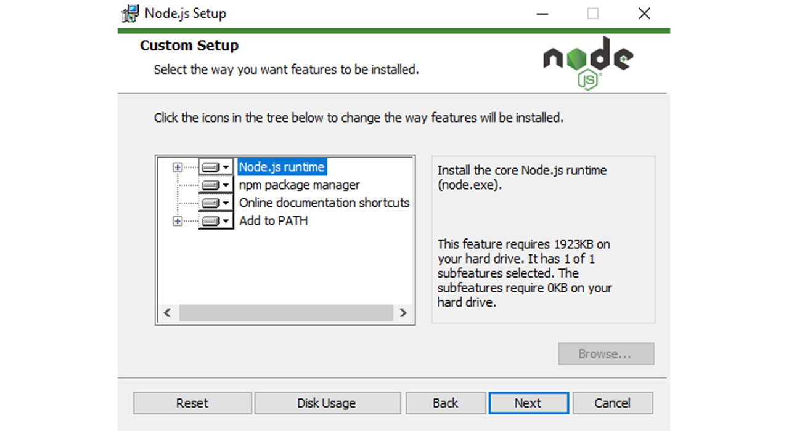
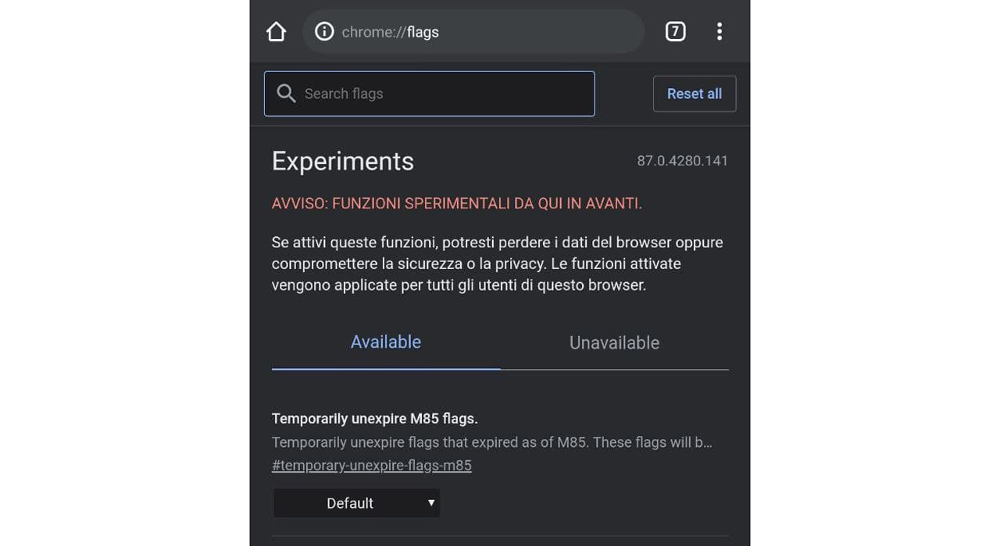
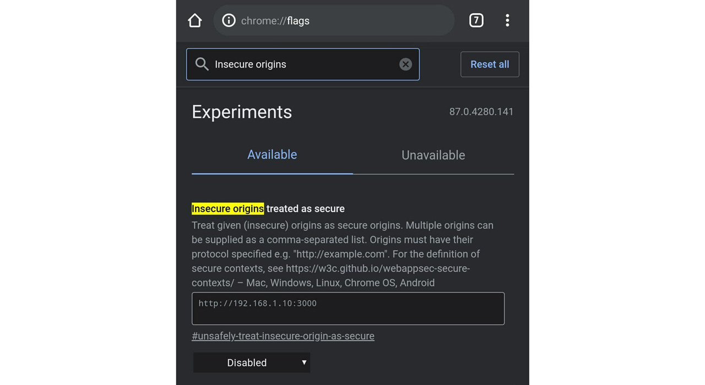
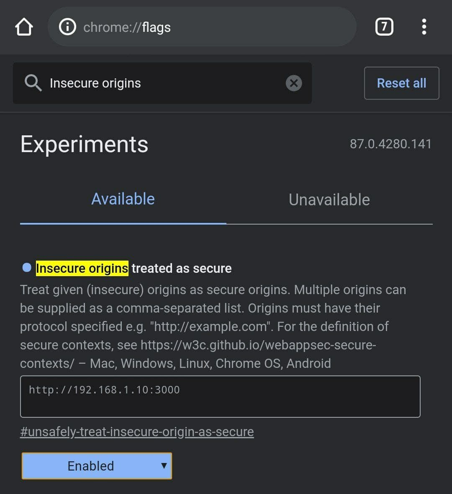

# Installation Guide

## DB Setup

In the `db` folder you can find the database schema to use. Setup the DB credentials in `src/controller/db/DatabaseConnection.js`

## NodeJS Installation

Download and Install NodeJS runtime from here: [NodeJS Download](https://nodejs.org/en/)

>**IMPORTANT**
>
>During the installation make sure to have both `npm package manager` and `Add to PATH` features selected.
>
>

## Install Dependencies
1. Clone the Repo
2. Move inside CLup folder
3. Open a Shell/Command Prompt there
4. Run `npm install`

If any error occurs make sure to have Administration/root Privileges on the Shell.

## Run the Server
1. Move inside the CLup folder
2. Open a Shell/Command Promt there
3. Run `npm run start`
   
## External Device Setup
>**IMPORTANT**
> 
> This application requires camera access to work properly (the store manager has to scan tickets). Due to security costraints all navigation browsers (e.g. Chrome, Firefox, Safari) don't allow the web page to access the device features (like the camera) outside of `localhost` when the connection is not secure (HTTP instead of HTTPS). For more information: [MDN Web Docs](https://developer.mozilla.org/en-US/docs/Web/Security/Secure_Contexts).
>
>The only solution is avaiable on Chrome and consists of adding the webserver's IP to the trusted lists.

1. Open Chrome on the smartphone.
   
2. Go to: `chrome://flags`. 
   
   
   
3. Search for: `Insecure origins treated as secure`.
   
4. Insert in the text box `http://IP_OF_THE_MACHINE_YOU_ARE_RUNNING_NODE:3000`.
   
   

5. Click on the button `Disabled` and Enable it. 
   
   

6. Reload Chrome as suggested. 
   
   

## Network Setup
* Your Machine hosting the webserver and your Smartphone must be on the same local network. In this way you can connect using the local IP address instead of the public one, avoiding any unecessary port forwarding on the router.
* When configuring the Smartphone always use the local IP Address.

## Enjoy CLup
Now you can go to `http://IP_OF_THE_MACHINE_YOU_ARE_RUNNING_NODE:3000` and use CLup!