# Design Document <!-- omit in toc -->
## Customers Line-up <!-- omit in toc -->
### Authors: <!-- omit in toc -->
- [Alessandro Ferrara](https://github.com/ferrohd)
- [Lorenzo Fratus](https://github.com/lorenzofratus)

#### Version: 0.0.2 <!-- omit in toc -->
#### Date: 19/12/2020 <!-- omit in toc -->
#### Professor: Elisabetta Di Nitto <!-- omit in toc -->
 

- [1. Introduction](#1-introduction)
  - [A. Purpose](#a-purpose)
  - [B. Scope](#b-scope)
  - [C. Definitions, acronyms and abbreviations](#c-definitions-acronyms-and-abbreviations)
  - [D. Revision history](#d-revision-history)
  - [E. Reference document](#e-reference-document)
  - [F. Document structure](#f-document-structure)
- [2. Architectural design](#2-architectural-design)
  - [A. Overview](#a-overview)
  - [B. Component view](#b-component-view)
    - [B.1. High level component](#b1-high-level-component)
    - [B.2. Clupper Services projection](#b2-clupper-services-projection)
    - [B.3. Store Manager Services projection](#b3-store-manager-services-projection)
    - [B.4. Account Services projection](#b4-account-services-projection)
    - [B.5. ER diagram](#b5-er-diagram)
  - [C. Deployment view](#c-deployment-view)
    - [C.1. Recommended implementation](#c1-recommended-implementation)
  - [D. Runtime view](#d-runtime-view)
    - [D.1 User login](#d1-user-login)
    - [D.2 Clupper booking](#d2-clupper-booking)
    - [D.3 Store manager scan ticket](#d3-store-manager-scan-ticket)
  - [E. Component interface](#e-component-interface)
    - [E.1 Clupper interface](#e1-clupper-interface)
    - [E.2 Store manager interface](#e2-store-manager-interface)
    - [E.3 Account management](#e3-account-management)
  - [F. Selected architectural styles and patterns](#f-selected-architectural-styles-and-patterns)
  - [G. Other design decisions](#g-other-design-decisions)
- [3. User interface design](#3-user-interface-design)
  - [A. UI mockups](#a-ui-mockups)
  - [B. UX diagrams](#b-ux-diagrams)
    - [B.1. Visitor](#b1-visitor)
    - [B.2. Clupper](#b2-clupper)
    - [B.3. Store manager](#b3-store-manager)
- [4. Requirements traceability](#4-requirements-traceability)
- [5. Implementation, integration and test plan](#5-implementation-integration-and-test-plan)
- [6. Effort spent](#6-effort-spent)
  - [Pair programming](#pair-programming)
  - [Ferrara Alessandro](#ferrara-alessandro)
  - [Fratus Lorenzo](#fratus-lorenzo)
- [7. References](#7-references)

## 1. Introduction
### A. Purpose
### B. Scope
### C. Definitions, acronyms and abbreviations
### D. Revision history
### E. Reference document
### F. Document structure

## 2. Architectural design

### A. Overview

The Customers Line-up system has a four-tier architecture that can be grouped into 3 logical layers: presentation, application and data.  

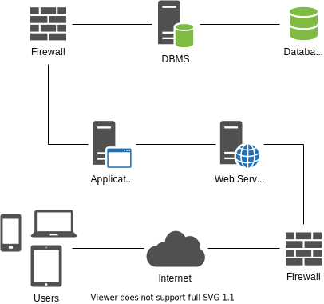

On the client side there is nothing but a browser used to connect to the web server and to dynamically update the *Web App View* when needed (only for minor changes).  

The web server, on the other hand, acts as a middleware between the client interface and the system logic, communicating with the user via the standard HTTP protocol (or HTTPS), receiving requests and providing adequate responses. To do this, this node also interacts with the application server to submit changes in user data and to request pieces of information needed to generate and update the UI.  

Finally, the business logic of the system resides on the application server (*Backend*). This node is able to manage the connection with the DBMS and takes care of carrying out the necessary processing for the correct functioning of the system.  

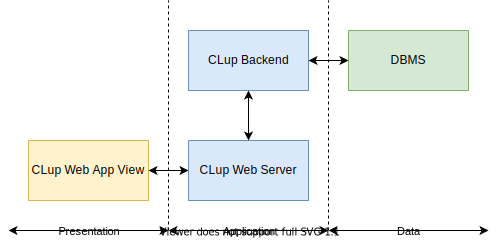

### B. Component view

The following diagrams show the main components of the CLup system and the interfaces through which they interact.  
For clarity, the first diagram shows a high level view of the components, which are then further explored individually.

The system exposes a RESTful API with multiple public endpoint and resources, some of them require a proper authentication and authorization to be used.

#### B.1. High level component
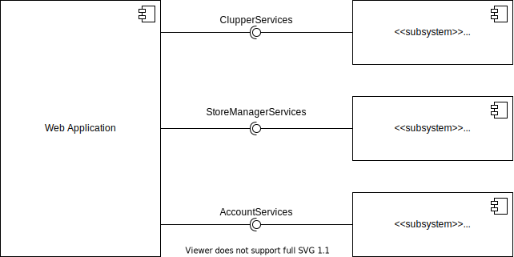

The client side consists of a single component that refers to the web application, the only access point to this system.

The server side, on the other end, is made of three subsystems:
- **Clupper Services**: provides access to the basic services of the application after the login, this services are reserved to the cluppers.
- **Store Manager Services**: provides access to the managerial services of the application after the login, this services are reserved to the store managers.
- **Account Services**: provides support to registration, login and logout operations for any type of user.

#### B.2. Clupper Services projection
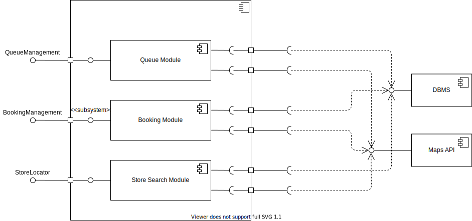

The Clupper Services subsystem contains three components:
- **Queue Module**: offers the *QueueManagement* interface to handle all the operations related to the join the queue function. 
- **Booking Module**: offers the *BookingManagement* interface to handle all the operations related to the book a visit function.
- **Store Locator**: offers the *StoreLocator* interface that allows the client to retrieve information about the stores.

In order to fulfill their goals, these components need to communicate with the DBMS and the Maps API through the corresponding interfaces.

#### B.3. Store Manager Services projection
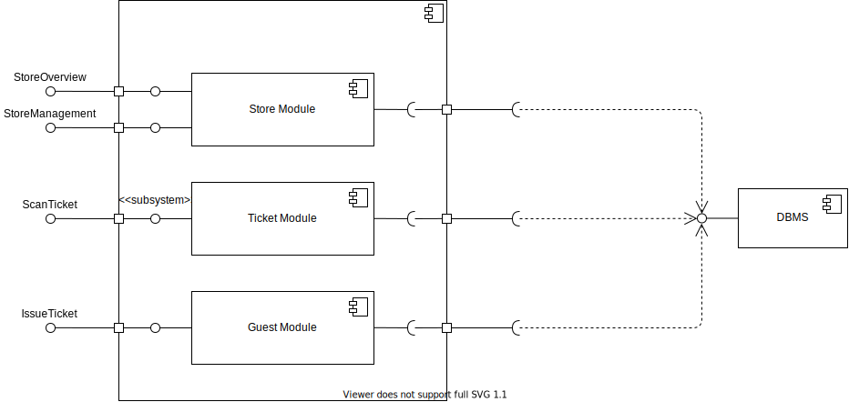

The Store Manager Services subsystem contains three components:
- **Store Module**: offers the *StoreOverview* and the *StoreManagement* interfaces used to receive store status updates and to edit the store maximum capacity respectively.
- **Ticket Module**: offers the *ScanTicket* interface to receive feedback on scanned tickets.
- **Guest Module**: offers the *IssueTicket* interface to request a queue ticket for a guest.

In order to fulfill their goals, these components need to communicate with the DBMS.

*[Camera, Printer external interfaces?]*  
TODO

#### B.4. Account Services projection
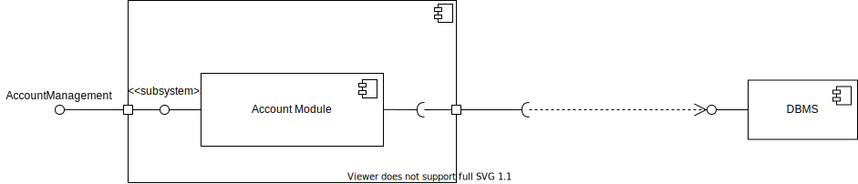
The Account Services subsystem contains one component:
- **Account Module**: offers the *AccountManagement* interface to handle the operations of register, login and logout

In order to fulfill its goals, this component needs to communicate with the DBMS.

#### B.5. ER diagram
TODO

### C. Deployment view

The system architecture is divided in 4 tiers:
- The first tier is the *client tier*: it is composed by any device capable of rendering a web page (smartphones, tablets, PC). It communicates with the web tier through the HTTP protocol.
- The *web tier* contains the web server implemented with Nginx platform. This tier is provided with a load balancer to distribute the load between the multiple istances of the application tier.
- The third tier is the *application tier*. The CLup backend is built on an Express application which is managed by a docker-like process manager to spawn multiple istances. The execution enviroment is the NodeJS runtime.
- The *data tier* is the fourth tier composed by the Database server.

#### C.1. Recommended implementation

- **Client tier**: The client web browser may be an arbitrary one, the only costraint is that it must be recent enough to render HTML5 and CSS3 web pages and execute Javascript.
- **Web tier**: The web tier must be implemented with Nginx web server. A load balancer is also needed to distribute the load between the multiple istances of the application. It is strongly recommended to setup the load balancer to use a Round Robin algorithm to distribute the load, to avoid overloading a single application istance.
- **Application tier**: The runtime engine where the backend lives is NodeJS and a docker-like process manager (PM2) is used to spawn multiple istances of the application, which uses ExpressJS to expose services.
- **Data tier**: The database is relational and is implemented using MySQL.

### D. Runtime view

The following sequence diagrams describe the interactions between the main compontents of the product when utilizing the most common features. This is still a high-level description of the actual interactions so that they can be slightly modified during the developement process.

#### D.1 User login
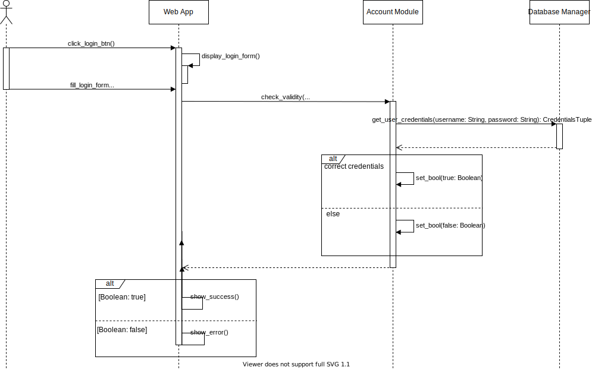

#### D.2 Clupper booking
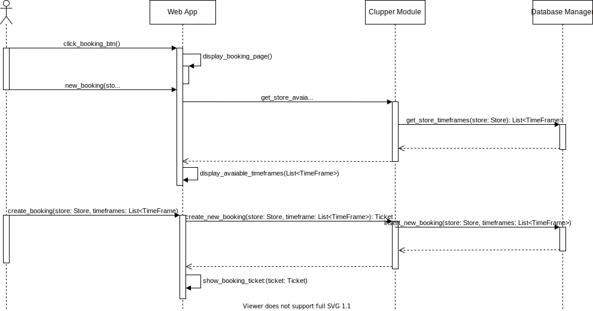

#### D.3 Store manager scan ticket
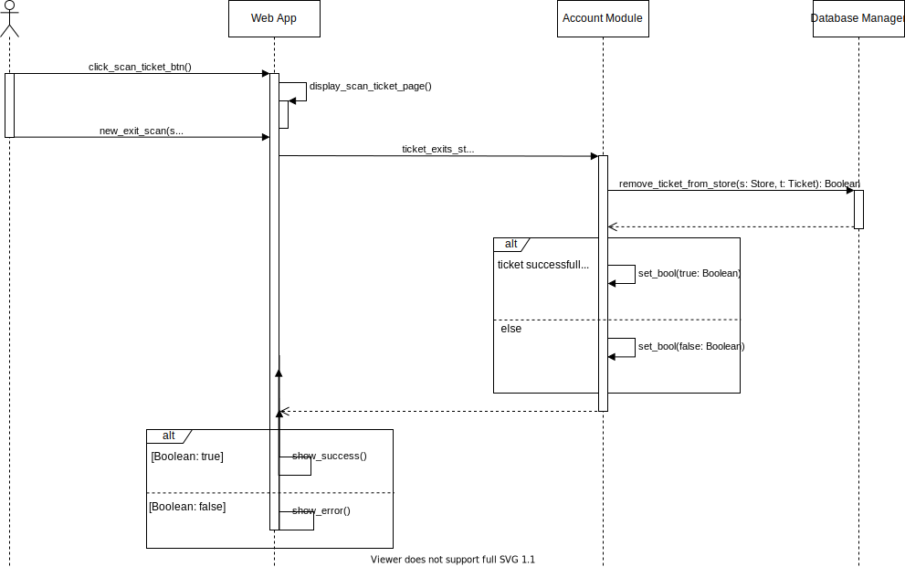

### E. Component interface

These diagrams show the main methods provided by each component:
- The *ClupperServices* interface provides every method the clupper could need to acces every functionality of the application. In particular there are methods to join the queue, book a visit and find stores.
- Like CustomerServices, *StoreManagerServices* provides all methods a store manager needs to manage the store. In fact, he's allowed to edit the store capacity, check the number of customers inside, in line and with a reservation and lend out physical tickets to guests. 
- *AccountServices* is an interface accessible by both users and visitors. It let's the users login and logout and allows the registration of new cluppers or store managers.

#### E.1 Clupper interface
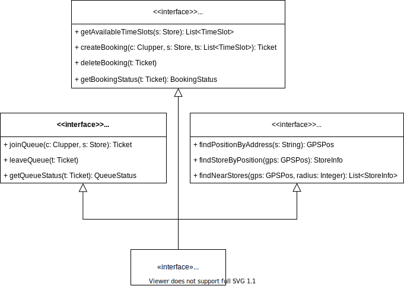

#### E.2 Store manager interface
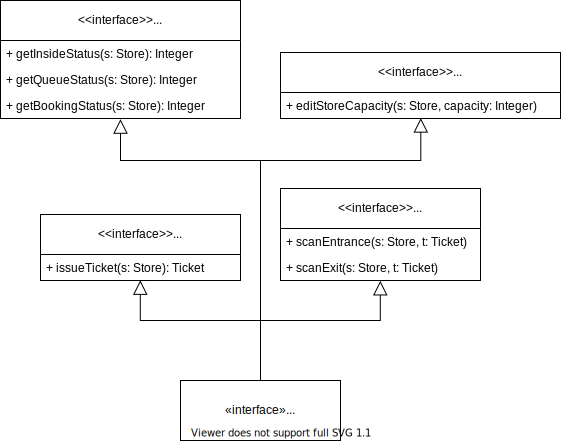

#### E.3 Account management

### F. Selected architectural styles and patterns
*[Styles/patterns used, why and how]*
TODO

### G. Other design decisions
TODO (API USAGE)

## 3. User interface design

### A. UI mockups

The following mockups (already presented in section *3.A.1. User interfaces* of the RASD) provide an idea of how the web application offered by CLup will look like.

Since the main devices that will use the system are portable, a mobile-first approach is recommended in the UI development, however, the client view must be designed responsively to best fit any screen size.

TODO

### B. UX diagrams

The following UX diagrams provide additional information about the journey of the various users inside the CLup web application.

The paths represented in the following diagrams take for granted the absence of exceptions of any kind. Each exception is handled as explained in the section *3.B.1. Use cases* of the RASD.

Using the *back* button provided by the web browser or the device will result in the default behaviour (previous page in history) and will therefore be ignored in this context.  

#### B.1. Visitor
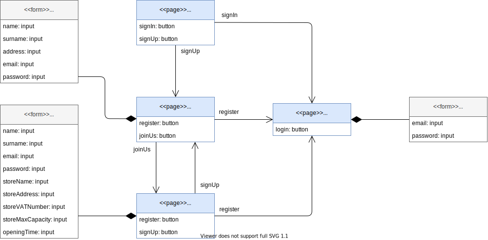

The direct path from the *Home* page to the *UserLogin* page is considered as the default behaviour and therefore omitted in the next diagrams. The *LoginCredentials* form is also not reported for clarity.

#### B.2. Clupper

The *NavBar* component is included in every page accessible by the clupper except the "UserLogin" page, the arrow is omitted to improve readability.  
The *StoreTile* and *BookingTile* can be included multiple times on the same page (with different data), they are classified as *clickable* since they behave like a button.

#### B.3. Store manager
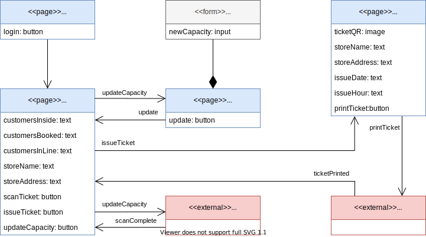

*Camera* and *Printer* represent the use of that specific external component (required for the correct functioning of the application) and have been included in the diagram to better clarify the sequence of actions that the store manager will perform.

## 4. Requirements traceability
*[How requirements (RASD) map to the design elements (DD)]*
TODO

## 5. Implementation, integration and test plan
*[Order in which we plan to implement the subcomponents and the order in which we plan to integrate them and test their integration]*
TODO

## 6. Effort spent

### Pair programming

| Topic                                                            |      Hours |
|:-----------------------------------------------------------------|-----------:|
| Architectural design diagrams                                    |       3.5h |
 

### Ferrara Alessandro

| Topic                                                            |      Hours |
|:-----------------------------------------------------------------|-----------:|
| Component Interface Diagrams                                     |       1.0h |
| Sequence Diagrams                                                |       1.0h |
 

### Fratus Lorenzo

| Topic                                                            |      Hours |
|:-----------------------------------------------------------------|-----------:|
| UX diagrams                                                      |       2.0h |
| DD structure                                                     |       1.0h |
| Sections 2 and 3                                                 |       2.5h |
 

## 7. References