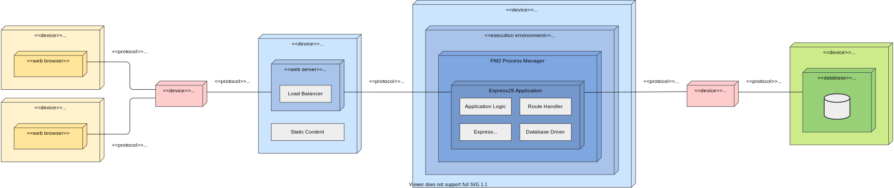
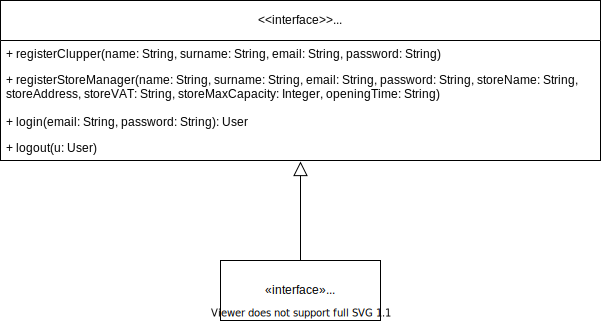

# Design Document <!-- omit in toc -->
## Customers Line-up <!-- omit in toc -->
### Authors: <!-- omit in toc -->
- [Alessandro Ferrara](https://github.com/ferrohd)
- [Lorenzo Fratus](https://github.com/lorenzofratus)

#### Version: 0.0.1 <!-- omit in toc -->
#### Date: 15/12/2020 <!-- omit in toc -->
#### Professor: Elisabetta Di Nitto <!-- omit in toc -->
 

- [1. Introduction](#1-introduction)
  - [A. Purpose](#a-purpose)
  - [B. Scope](#b-scope)
  - [C. Definitions, acronyms and abbreviations](#c-definitions-acronyms-and-abbreviations)
  - [D. Revision history](#d-revision-history)
  - [E. Reference document](#e-reference-document)
  - [F. Document structure](#f-document-structure)
- [2. Architectural design](#2-architectural-design)
  - [A. Overview](#a-overview)
    - [A.1. Physical architecture](#a1-physical-architecture)
    - [A.2. High level layers](#a2-high-level-layers)
  - [B. Component view](#b-component-view)
    - [B.1. High level component](#b1-high-level-component)
    - [B.2. Clupper Services projection](#b2-clupper-services-projection)
    - [B.3. Store Manager Services projection](#b3-store-manager-services-projection)
    - [B.4. Account Services projection](#b4-account-services-projection)
    - [B.5. ER diagram](#b5-er-diagram)
  - [C. Deployment view](#c-deployment-view)
    - [C.1. Recommended implementation](#c1-recommended-implementation)
  - [D. Runtime view](#d-runtime-view)
    - [D.1 User Login](#d1-user-login)
    - [D.1 Clupper Booking](#d1-clupper-booking)
    - [D.1 Store Manager Scan Ticket](#d1-store-manager-scan-ticket)
  - [E. Component interface](#e-component-interface)
    - [E.1 Clupper Interface](#e1-clupper-interface)
    - [E.1 Store Manager Interface](#e1-store-manager-interface)
    - [E.1 Account Management](#e1-account-management)
  - [F. Selected architectural styles and patterns](#f-selected-architectural-styles-and-patterns)
  - [G. Other design decisions](#g-other-design-decisions)
- [3. User interface design](#3-user-interface-design)
  - [A. UI mockups](#a-ui-mockups)
  - [B. UX diagrams](#b-ux-diagrams)
    - [B.1. Visitor](#b1-visitor)
    - [B.2. Clupper](#b2-clupper)
    - [B.3. Store manager](#b3-store-manager)
- [4. Requirements traceability](#4-requirements-traceability)
- [5. Implementation, integration and test plan](#5-implementation-integration-and-test-plan)
- [6. Effort spent](#6-effort-spent)
  - [Pair programming](#pair-programming)
  - [Ferrara Alessandro](#ferrara-alessandro)
  - [Fratus Lorenzo](#fratus-lorenzo)
- [7. References](#7-references)

## 1. Introduction
### A. Purpose
### B. Scope
### C. Definitions, acronyms and abbreviations
### D. Revision history
### E. Reference document
### F. Document structure

## 2. Architectural design
### A. Overview
*[High level components and their interaction]*  
TODO

#### A.1. Physical architecture

TODO

#### A.2. High level layers

TODO

### B. Component view
TODO

#### B.1. High level component

TODO

#### B.2. Clupper Services projection

TODO

#### B.3. Store Manager Services projection

*[Camera, Printer external interfaces?]*  
TODO

#### B.4. Account Services projection

TODO

#### B.5. ER diagram
TODO

### C. Deployment view

Thte system architecture is divided in 4 tiers.
- The first tier is the *client tier*:it's composed by any device capable of rendering a web page (smartphones, tablets, ecc.). It communicates with the web tier through the HTTP protocol.
- The *web tier* contains the web server implemented with Nginx platform. This tier is provided with a load balancer to distribute the load between the multiple istances of the application tier.
- The third tier is the *application tier*. The CLup backend is built on a Express application which is managed by a docker-like process manager to spawn multiple istances. The execution enviroment is the NodeJS runtime.
- The *data tier* is the fourth tier composed by the Database server.

#### C.1. Recommended implementation
- **Client tier**: The client web browser may be an arbitrary one, the only costraint is that it must be recent enough to render HTML5 and CSS3 web pages and execute Javascript.
- **Web tier**: The web tier must be implemented with Nginx web server. A load balancer is also needed to distribute the load between the multiple istances of the application. It's strongly recommended to setup the load balancer to use a Round Robin algorithm to distribute the load, to avoid overloading a single application istance.
- **application tier**: The runtime engine where the backend lives is NodeJS and a docker-like process manager (PM2) is used to spawn multiple istances of the application, which uses ExpressJS to expose services.
- **data tier**: The database is relational and is implemented using MySQL.

### D. Runtime view
The following sequence diagrams describe the interactions between the main compontents of the product when utilizing the most common features. This is stil a high-level description of the actual interactions so they can be modified during the developement process.
#### D.1 User Login

#### D.1 Clupper Booking

#### D.1 Store Manager Scan Ticket

### E. Component interface
These diagrams show the main method provided by each component.
- The interface *ClupperServices* provide every method the Clupper could need to acces every functionality of the app. In particular there are methods for join/leave the queue, book a visit and find Stores.
- Like CustomerServices, *StoreManagerServices* provides all methods a Store Manager needs to manage the Store. Infact he's allowed to edit the store capacity, check the queue status and the number of people inside and lend out physical tickets.
- *AccountServices* is a interface accessible by all the Users and Visitors. It let's the Users log-in and logout and allows the registration of new Cluppers or Store Managers.
#### E.1 Clupper Interface

#### E.1 Store Manager Interface

#### E.1 Account Management

### F. Selected architectural styles and patterns
*[Styles/patterns used, why and how]*
TODO

### G. Other design decisions
TODO (API USAGE)

## 3. User interface design
TODO (BCE DIAGRAMS?)

### A. UI mockups
TODO

### B. UX diagrams
TODO

#### B.1. Visitor

#### B.2. Clupper

#### B.3. Store manager

## 4. Requirements traceability
*[How requirements (RASD) map to the design elements (DD)]*
TODO

## 5. Implementation, integration and test plan
*[Order in which we plan to implement the subcomponents and the order in which we plan to integrate them and test their integration]*
TODO

## 6. Effort spent

### Pair programming

| Topic                                                            |      Hours |
|:-----------------------------------------------------------------|-----------:|
| Architectural design diagrams                                    |       3.5h |
 

### Ferrara Alessandro

| Topic                                                            |      Hours |
|:-----------------------------------------------------------------|-----------:|
| Component Interface Diagrams                                     |       1.0h |
| Sequence Diagrams                                                |       1.0h |
 

### Fratus Lorenzo

| Topic                                                            |      Hours |
|:-----------------------------------------------------------------|-----------:|
| UX diagrams                                                      |       2.0h |
| DD structure                                                     |       1.0h |
 

## 7. References