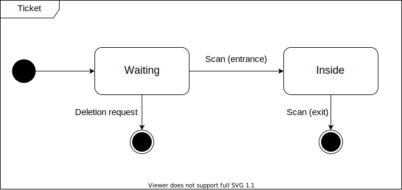
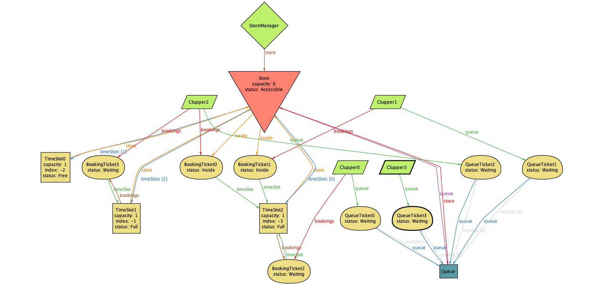

# Requirements Analysis and Specification Document
## Authors:
- [Alessandro Ferrara](https://github.com/ferrohd)
- [Lorenzo Fratus](https://github.com/lorenzofratus)

#### Version: 0.1.1
#### Date: 14/12/2020
#### Professor: Elisabetta Di Nitto
<br>

- [Requirements Analysis and Specification Document](#requirements-analysis-and-specification-document)
  - [Authors:](#authors)
      - [Version: 0.1.1](#version-011)
      - [Date: 14/12/2020](#date-14122020)
      - [Professor: Elisabetta Di Nitto](#professor-elisabetta-di-nitto)
  - [1. Introduction](#1-introduction)
    - [A. Purpose](#a-purpose)
    - [B. Scope](#b-scope)
      - [B.1. Description of the given problem](#b1-description-of-the-given-problem)
      - [B.2. Current system](#b2-current-system)
      - [B.3. Goals](#b3-goals)
      - [B.4. Discarded features](#b4-discarded-features)
    - [C. Definitions, acronyms and abbreviations](#c-definitions-acronyms-and-abbreviations)
      - [C.1. Definitions](#c1-definitions)
      - [C.2. Acronyms](#c2-acronyms)
      - [C.3. Abbreviations](#c3-abbreviations)
    - [D. Revision history](#d-revision-history)
    - [E. Reference documents](#e-reference-documents)
    - [F. Document structure](#f-document-structure)
  - [2 Overall description](#2-overall-description)
    - [A. Product perspective](#a-product-perspective)
      - [A.1. Scenarios](#a1-scenarios)
      - [A.2. Class diagram](#a2-class-diagram)
      - [A.3. State diagrams](#a3-state-diagrams)
    - [B. Product functions](#b-product-functions)
      - [B.1. Join the queue (digital) - Basic service](#b1-join-the-queue-digital---basic-service)
      - [B.2. Book a visit - Basic service](#b2-book-a-visit---basic-service)
      - [B.3. Join the queue (physical) - Managerial service](#b3-join-the-queue-physical---managerial-service)
      - [B.4. Store overview - Managerial service](#b4-store-overview---managerial-service)
      - [B.5. Ticket scan - Managerial service](#b5-ticket-scan---managerial-service)
    - [C. User characteristics](#c-user-characteristics)
      - [C.1. Clupper](#c1-clupper)
      - [C.2. Store manager](#c2-store-manager)
      - [C.3. Other stakeholders](#c3-other-stakeholders)
    - [D. Assumptions, dependecies and constraints](#d-assumptions-dependecies-and-constraints)
      - [D.1. Text assumptions](#d1-text-assumptions)
      - [D.2. Domain assumptions](#d2-domain-assumptions)
  - [3. Secific requirements](#3-secific-requirements)
    - [A. External interface requirements](#a-external-interface-requirements)
      - [A.1. User interfaces](#a1-user-interfaces)
      - [A.2. Hardware interfaces](#a2-hardware-interfaces)
      - [A.3. Software interfaces](#a3-software-interfaces)
      - [A.4. Communication interfaces](#a4-communication-interfaces)
    - [B. Functional requirements](#b-functional-requirements)
      - [B.1. Use cases](#b1-use-cases)
      - [B.2. Use case diagrams](#b2-use-case-diagrams)
      - [B.3. Sequence diagrams](#b3-sequence-diagrams)
      - [B.4. Mapping on requirements](#b4-mapping-on-requirements)
    - [C. Performance requirements](#c-performance-requirements)
    - [D. Design constraints](#d-design-constraints)
      - [D.1. Standards compliance](#d1-standards-compliance)
      - [D.2. Hardware limitations](#d2-hardware-limitations)
      - [D.3. Any other constraint](#d3-any-other-constraint)
    - [E. Software System Attributes](#e-software-system-attributes)
      - [E.1. Reliability and avaiability](#e1-reliability-and-avaiability)
      - [E.2. Security](#e2-security)
      - [E.3. Maintainability](#e3-maintainability)
      - [E.4. Portability](#e4-portability)
  - [4. Formal analysis using Alloy](#4-formal-analysis-using-alloy)
    - [A. Alloy code](#a-alloy-code)
    - [B. Execution result](#b-execution-result)
    - [C. Generated worlds](#c-generated-worlds)
      - [C.1. World 1](#c1-world-1)
      - [C.2. World 2](#c2-world-2)
  - [5. Effort spent](#5-effort-spent)
    - [Pair programming](#pair-programming)
    - [Ferrara Alessandro](#ferrara-alessandro)
    - [Fratus Lorenzo](#fratus-lorenzo)
  - [6. References](#6-references)

## 1. Introduction

### A. Purpose

This document focuses on Requirements Analysis and Specification Document (RASD) and contains the description of the main goals, the domain and its representation through some models, the analysis of the scenario with the uses cases that describe them, the list of the most important requirements and specifications that characterize the development of the software described below.

It also includes the research about the interfaces, functional and non-functional requirements and the attributes that distinguish the quality of the system.

Finally, to understand better the development of the document, it contains the history that describes how it is made, with the references used and the description of its structure.

This document has the purpose to guide the developers in the realization of the software called Customers Line-up.

### B. Scope

#### B.1. Description of the given problem

The software wants to foster a safe shopping experience by providing a customer flow control system. This system should allow the users to avoid crowds both inside and outside the stores.
Customers Line-up offers two main functionalities:

- **Join a queue**: the customers can “line up” from their home, and then wait until their turn is coming to approach the store. In addition, the application is used to generate tickets that are scanned upon entering and leaving the store, thus allowing store managers to monitor the flow of customers.

- **Book a visit**: the customers are able to book a visit at the store selecting one or more consecutive time slots. In this way they are able to avoid any waiting time at the entrance of the store. For long-term customers, the system is able to propose the number of time slots based on an analysis of the previous visits.

Clearly, for the application to effectively work in practice, all customers should use it to access the store, and this implies that:

- The software should be very simple to use to adapt to a wide range of users, therefore it must include all demographics.
- The system should provide customers with a reasonably precise estimation of the waiting time and should be able to manage situations where a customer approaches the store with an accettable delay.
- The stores should still provide fallback options for those people who do not have access to the required tecnology, for example handing out physical tickets on the spot.

#### B.2. Current system

Customers Line-up is a new service that is approaching the market for the first time.
The development of the system starts from scratch, for this reason no legacy system has been considered in our process.

#### B.3. Goals

| GX | Description of the goal |
|----|:------------------------|
| G1 | Allow a clupper to join a store queue without having to physically approach the store |
| G2 | Allow a guest to join a store queue by requesting it to the store manager |
| G3 | Allow a clupper to leave a store queue before entering |
| G4 | Allow a clupper to book a visit to the store |
| G5 | Allow a clupper to cancel a reservation to a store before entering |
| G6 | Allow a clupper to approach at the right time the store he has a ticket for |
| G7 | Allow a store manager to have an overview of the store |
| G8 | Allow a store manager to regulate the entrances to the store |
| G9 | Allow a store manager to regulate the exits from the store |
<br>

#### B.4. Discarded features

The assignment document contains an additional feature regarding the function called "Book a visit", we report here an excerpt:

*"The application might also allow users to indicate, if not the exact list of items that they intend to purchase, the categories of items that they intend to buy. This would allow the application to plan visits in a finer way..."*

After careful analysis, we decided to not include it in this document for the following reasons:
- This software is intended to be used in any store, to implement this functionality we should ask each store manager for the list of available products and their arrangement inside the building.
- This functionality can have a positive influence on achieving the main goal of the system only if every customer is willing to use it. This result is nearly impossible to obtain, just think of the customers who do not have access to the required technologies or those who prefer not to communicate their purchase intentions.
- Even if every customer used this functionality, the problem of avoiding crowds would recur in the common areas of the store (e.g. checkout).
- The presence of this feature may reduce the interest of stores in using our software. The customer may feel compelled to purchase only the previously declared products and this behavior would be against any supermarket marketing strategy.

### C. Definitions, acronyms and abbreviations

#### C.1. Definitions

- **Visitor**: person which is not registered to the system but is performing the operations to register.
- **User**: person which is correctly registered to the system, it abstracts the concepts of clupper and store manager.
- **Customer**: person which wants to enter a store, it abstracts the concepts of clupper and guest.
- **Clupper**: person (both user and customer) which is able to use the basic services offered by CLup (join a queue and book a visit).
- **Guest**: person (customer) which is not registered to the system or that is currently unable to use the application, and therefore cannot take advantage of the services offered by CLup.
- **Store manager**: person (user) which is able to use the managerial services offered by CLup.
- **Store**: physical buisiness registered to the system (by registering his store manager).
- **Store capacity**: maximum number of customers allowed inside a store (according to the regulations currently in force it corresponds to half of the capacity of the building).
- **Ticket**: QR code issued to a user as a receipt for queuing or booking at a store. It can be digital or physical and grants the access to the store based on the transaction that generated it.
- **Valid ticket**: a ticket is valid if the store contained in it matches the one of the store manager which scanned it and:
  - the ticket is the first in the store queue, if the ticket has been generated by a "Join the queue" function;
  - the time slots linked to the ticket include the current timestamp, if the ticket has been generated by a "Book a visit" function;
- **Booking/reservation**: digital ticket owned by a clupper to enter a store for one or more specific time slots.
- **Queue**: imaginary list of tickets, bound to a store, ordered by their time of issue, it does not contain tickets of customers with a reservation.
- **Time slot**: a half-hour time window.
- **Free time slot**: a time slot is considered free if the store is open during that period and the number of reservations already acquired over that slot does not exceed a quarter of the capacity of the store.

#### C.2. Acronyms

- **RASD**: Requirements Analysis and Specification Document.
- **GPS**: Global Positioning System.

#### C.3. Abbreviations

- **CLup**: Customers Line-up.
- **Gx**: Goal number x.
- **Dx**: Domain assumption number x.
- **Rx**: Functional requirement number x.

### D. Revision history

| Version | Date        | Description                          |
|:--------|:------------|:-------------------------------------|
| 1.0     | XX Nov 2020 | First version                        |

### E. Reference documents
- Assignment document A.Y. 2020/2021 ("Requirement Engineering and Design Project: goal, schedule, and rules")

### F. Document structure

- **Section 1: Introduction**: The first section provides an introduction to the purpose of the document and the objectives of the project. Included here is an analysis of the context in which the system will operate, along with a glossary including definitions, acronyms and abbreviations used in this document.
- **Section 2: Overall description**: This section opens with the description of some scenarios that demonstrate the possible uses of the application, followed by a description of the domain (done through class and state diagrams). Subsequently, the section includes the main functions of the application and the description of user characteristics. At the end of the section, the main assumptions relevant to the functioning of the system are then presented, divided into text and domain assumptions.
- **Section 3: Specific requirements**: This part of the document provides more details, which may be useful to the development team, on the aspects presented in the previous section. Included here are the system requirements (both functional and non-functional) and their mapping to the goals presented in section 2. The specific use cases, developed here from the scenarios, are then enriched with different UML diagrams.
- **Section 4: Formal analysis using Alloy**: This section includes the Alloy code accompanied by some of the worlds obtained by running it. A brief introduction clarifies the goal of the modeling activity itself.
- **Section 5: Effort spent**: This section includes information on the number of hours each group member worked for this document.

## 2 Overall description

### A. Product perspective

#### A.1. Scenarios

##### A.1.1. Scenario 1 <!-- omit in toc -->

The project manager has left the call with his team to answer another phone call, once again, so Kevin and his colleagues have a chance of taking a break.  

Beatrix starts talking about this new software called Customers Line-up and how useful it is and since Kevin was already planning to go to the supermarket after work, he decides to give it a try.  

The registration proces is very simple, as she said, just go to the website, insert your data, and you are in!  
After selecting the nearest store on the map, Kevin decides to book an half hour visit from 7 pm; the whole process took just a few minutes just as long as he had before he went back to work.  

At 6:45 pm the meeting is finally over and Kevin is so tired that he would rather order something from his favorite restaurant than go to the shop, so he logs into CLup again and goes to the page called "Reservations" where he finds his ticket and deletes it.  
Sorry Beatrix, I will try it another day, he thinks.

##### A.1.2. Scenario 2 <!-- omit in toc -->

Glancing out of the shop, Constance realizes that the queue has become absurdly long, managing customers has become increasingly difficult since the beginning of the emergency.  
She was afraid of introducing new software to her store, but she has to find a solution and, in any case, the service she has seen advertised in recent weeks, CLup, seems very simple to use and almost every store in the neighborhood is adopting it.  

That evening, after closing, Constance takes out her phone to register to the system, all she has to do is enter some details about herself and her business.  
She already has all the necessary equipment, so the only things left to do is inform her employees of the news and put up a sign to let customers know.  

The next day Lucas is in charge of managing the flow of customers, all he has to do is pick up his phone and log into the system using the store credentials. Now he can get a complete overview of the store and start welcoming customers. 

##### A.1.3. Scenario 3 <!-- omit in toc -->

Jonathan looks at his watch, it is already 11:30 and his pantry is almost empty, it will be better to fill it up quickly!  

He takes out his smartphone and, after logging into CLup using his credentials, he can join the queue of his favorite neighborhood store, all while dressing up.  
The waiting time is about 15 minutes, just enough to put on your shoes, put on a mask and take a walk to the supermarket.  

Once at the store, Jonathan goes to the page called "Queue" and sees that he is next to enter.  
As soon as Chad, the store manager, greets one customer and calls the next, Jonathan approaches him with his phone already unlocked.  
Chad clicks the "Scan Ticket" button, points the camera at the customer's device and, after confirming that the ticket is valid, lets him in.  

After paying for his groceries, Jonathan heads to the exit where he already knows he will have to show his ticket to Chad again before running home to prepare lunch.

##### A.1.4. Scenario 4 <!-- omit in toc -->

Clarice is an elderly lady and not very good with technology, she has an old phone without a data plan because she doesn't surf the web very often, and when she does she is together with her grandson Award.  

She needs to buy groceries but due to the current situation her neighborhood supermarket has introduced a system called the Customers Line-up and she doesn't feel confident about upgrading her equipment.  
In this regard, Award told her not to worry because she can simply ask the manager for a ticket and that she has to wait her turn even if she is the only one outside the store.  

Clarice doesn't understand this technology, but she trusts her grandson and after arriving at the shop she kindly asks the boy at the entrance if she can enter.  
The boy nods and she can see him click on the PC before handing her a paper ticket with a strange symbol on it.  
After a few minutes, Clarice is called by the boy who photographs the ticket and explains to keep it with her until the exit.

#### A.2. Class diagram


#### A.3. State diagrams

##### A.3.1. Ticket state <!-- omit in toc -->


##### A.3.2. Store state <!-- omit in toc -->


##### A.3.3. Time slot state <!-- omit in toc -->


### B. Product functions

#### B.1. Join the queue (digital) - Basic service

This function allows a clupper to line up for the desired store without having to immediately reach the store.
After selecting a supermarket from the map (searching around his GPS location or any address) the clupper will be able to see its details (name, address, number of customers already in line) and to join the queue.
The system will provide the clupper with a digital ticket, which he will be able to see directly from the application.
Finally, the clupper is able to leave the queue at any time before entering the store, this results in the deletion of his ticket.

#### B.2. Book a visit - Basic service

This function allows a clupper to book a visit to the desired store, thus avoiding the queuing process.
After selecting a supermarket from the map (searching around his GPS location or any address) the clupper will be able to see its details (name, address, number of customers already in line) and to add a reservation.
The system will request the clupper to select one or more consecutive time slots and will provide him with a digital ticket, which he will be able to see directly from the application.
Finally, the clupper is able to cancel his reservation at any time before entering the store, this results in the deletion of his ticket and the release of the acquired time slots.

#### B.3. Join the queue (physical) - Managerial service

This function is a fallback of the first one, indeed, it allows the store manager to insert into the queue any guest requesting it.
The system will provide the store manager with a digital ticket, which he will have to convert into physical (e.g. by printing it) and hand out to the guest.

#### B.4. Store overview - Managerial service

This function allows a store manager to have a live overview of the store.
The system will provide the store manager with the number of customers inside the store (compared to the capacity), those in the store queue and those with a reservation for the current time slot (that have not entered the store yet).
This data should allow him to regulate the flow of customers.

#### B.5. Ticket scan - Managerial service

This function allows a store manager to scan (and validate) a customer's ticket (both at the entrance and the exit of the store).
This has the double purpose of updating the data contained into the store overview, and make sure that the flow of customers corresponds to that expected by the system (no one should be able to enter before his turn).

### C. User characteristics

#### C.1. Clupper

Anyone who wants to become a clupper can do so by registering and entering his personal information.  
The main goal of a clupper is to avoid having to wait for his turn near a store, thus reducing the risk of COVID infection.  
To do so, the system offers a set of functions (called "basic services") with which he is able to join a queue from wherever he wants or to book a visit to enter the supermarket at a specific time.

#### C.2. Store manager

Due to the higher privileges offered to him by the system, to become a store manager a person shall enter, during the registration process, specific information about his work place (thus adding the store to the system).  
The goal of a store manager is to avoid crowds inside the building by limiting the flow of customers (to comply with current regulations).  
To do so the system offers a set of functions (called "managerial services") with which he is able to have an overview of the customers dealing with the store and to approve their entrances.

#### C.3. Other stakeholders

As explained in the previous sections, the system shall be able to provide fallback options for customers that need to enter a store but do not have access to the application. We define as **guest** any person who:
- Is not registered to the system (regardless of whether they have access to the required technology or not);
- Is registered to the system but is currently unable to use the application (e.g. no device with him, dead battery, no internet connection, ...);

The goal of a guest is the same as that of a clupper (the risk of infection is technically lower due to the fact that the majority of customers should be cluppers).  
By definition, a guest cannot directly take advantage of the services offered by the system, for this reason he is only able to join a queue by addressing the store manager.

### D. Assumptions, dependecies and constraints

In order to better clarify the presentation and avoid any ambiguities we decided to introduce the following assumptions.

#### D.1. Text assumptions

- Credentials that a person has to provide to become a clupper are: name, surname, address, email and password.
- Credentials that a person has to provide to become a store manager are: name, surname, email and password. He must also provide information about the store: name, address, VAT number, maximum capacity and opening time.
- Credentials that a user has to provide to login are: email and password.
- A User with a reservation can enter the store at any time during the booked time slots.

#### D.2. Domain assumptions

| DX | Description of the domain assumption |
|----|:-------------------------------------|
| D1 | The information provided by a user during the registration process is valid |
| D2 | The positions retrieved by GPS are always correct |
| D3 | The store manager will always add to the store queue any guest requesting it |
| D4 | The store manager will always grant the precedence of a customer with a reservation over those in the queue |
| D5 | The store manager will always keep enough space inside the store to accomodate the users with a reservation |
| D6 | At any time during the visit to a store, the customer shall be able to show the ticket with which he entered to the store manager |
| D7 | A clupper with a reservation should leave the store before the end of the acquired time slots |
| D8 | A customer is not able to enter a store before providing a valid ticket to the store manager |
| D9 | A customer is not able to leave a store before providing a valid ticket to the store manager |
<br>

## 3. Secific requirements

### A. External interface requirements

#### A.1. User interfaces

The following mockups represent an idea of what the application shall look like in the first release.

TODO

#### A.2. Hardware interfaces

The system requires each clupper to have at least one mobile device (such as a smartphone or tablet) that will be used to exibit the ticket to the store manager.  
The clupper can perform the operations to obtain a ticket also from a PC of any kind that will however not be sufficient to have access to the store.

The store manager needs a mobile device or a PC equipped with a camera to scan the tickets and a printer of any kind to hand out tickets to the guests.

#### A.3. Software interfaces

The CLup applicative is a web application, for this reason a relatively modern web browser is sufficient in order to render the application.

#### A.4. Communication interfaces

To perform any operation in the application, an Internet connection (WiFi or mobile) is required.  
When a clupper has queued-up or has booked for a visit, can interrupt the connection without losing the place in the queue or the booking (he will not have access to the live information such as place in the queue or expected waiting time).

A store manager always needs a stable internet connection in order to have access to the managerial services.

### B. Functional requirements

| RX | Description of the functional requirement |
|----|:------------------------------------------|
| R1 | A person is able to register to the system as a user. During the process, the system will ask him to provide the information required for the specific type of user |
| R2 | The system is able to verify that the email provided by a person during the registration process is unique |
| R3 | The system is able to verify that the VAT number provided by a store manager during the registration process is unique |
| R4 | The system is able to create a new store after the registration of store manager |
| R5 | A user is able to log into the system by entering his personal credentials |
| R6 | The system is able to generate a new ticket after receiving a request |
| R7 | A clupper is able to join at most one queue at any time (for any store) |
| R8 | The system is able to insert a ticket into a store queue |
| R9 | The system is able to remove a ticket from a store queue |
| R10 | A clupper is able to select as many consecutive free time slots as he wants while booking a visit to a store |
| R11 | A clupper cannot have multiple reservations in the same time slots |
| R12 | The system is able to retrieve the list of free time slots for each store |
| R13 | The system is able to acquire the selected free time slots when creating a new reservation to a store |
| R14 | The system is able to release the time slots acquired by a reservation when a clupper cancels it |
| R15 | The system is able to notify a clupper the time in which he should approach the store |
| R16 | A clupper is able to retrieve a previously obtained ticket |
| R17 | A store manager is able to change the maximum store capacity at any time |
| R18 | The system is able to infer the number of time slots to be proposed to a clupper when booking a visit to the store |
| R19 | A store manager is able to scan a customer’s ticket at the entrance of the store before letting him in only if the number of customers currently inside does not exceed its maximum capacity |
| R20 | A store manager is always able to scan a customer’s ticket at the exit of the store before letting him out |
| R21 | The system is able to perform a validity check on a ticket scanned by a store manager and to inform him about the result |
| R22 | The system is able to remove a customer's ticket from the store queue when it is scanned at the entrance |
| R23 | The system is able to invalidate a customer’s ticket when it is scanned at the exit |
| R24 | The system is able to retrieve the customer’s GPS location |
| R25 | The system is able to retrieve the GPS location from a specific address |
| R26 | The system is able to estimate the distance between two GPS locations |
| R27 | The system is able to get a list of stores around a GPS location |
| R28 | The system is able to retrieve the name and GPS location of a store |
| R29 | The system is able to retrieve the position of a clupper in a store queue |
| R30 | The system is able to estimate the waiting time for a clupper in a store queue |
| R31 | The system is able to retrieve the number of customers currently in a store queue |
| R32 | The system is able to retrieve the number of customers currently inside a store |
| R33 | The system is able to retrieve the number of reservations for a store during the current time slot |
<br>

#### B.1. Use cases

| VisitorRegisters  |                                                                              |
|-------------------|------------------------------------------------------------------------------|
| Actors            | Visitor                                                                      |
| Goals             | G1, G4, G7                                                                   |
| Input conditions  | The visitor is already on the home page.                                     |
| Events flow       | 1. The visitor clicks on the "Sign Up" button to start the registration process.<br>2. The visitor inserts his information in the mandatory fields.<br>3. The visitor clicks the "Register" button.<br>4. The system stores the inserted data.<br>5. The system redirects the visitor to the login page. |
| Output conditions | The visitor successfully ends the registration process and becomes a CLup user. From now on he can login to the application providing his credentials and use CLup. |
| Exceptions        | 1. The provided email is already registered.<br>2. The visitor inserts not valid informations in one or more mandatory fields.<br><br>All exceptions are handled notifying the issue to the visitor and taking back the event flow to the point 2. |
<br>

| UserLogsIn        |                                                                              |
|-------------------|------------------------------------------------------------------------------|
| Actors            | User                                                                         |
| Goals             | G1, G2, G3, G4, G5, G6, G7, G8, G9                                           |
| Input conditions  | The user is already on the home page.                                        |
| Events flow       | 1. The user clicks on the "Sign In" button to start the login process.<br>2. The User inserts his email and password into the corresponding fields.<br>3. The user clicks the "Login" button.<br>4. The system redirects the user to the map page. |
| Output conditions | The user successfully logs in. From now on he can use the CLup services. |
| Exceptions        | 1. The inserted email is not valid.<br>2. The inserted password is not valid.<br><br>All exceptions are handled notifying the issue to the user and taking back the event flow to the point 2. |
| Alternatives      | If the user is a store manager:<br>4. The system redirects the user to the overview page. |
<br>

| ClupperSelectsStore |                                                                            |
|-------------------|------------------------------------------------------------------------------|
| Actors            | Clupper                                                                      |
| Goals             | G1, G4                                                                       |
| Input conditions  | The clupper is already logged in and on the map page.                        |
| Events flow       | 1. The clupper inserts an address or clicks on the "Current Position" button<br>2. The system retrieves the GPS location and loads the stores on the map<br> 3. The clupper looks at the map and selects one of the available stores.<br>4. The system redirects the clupper to the store page. |
| Output conditions | The clupper successfully selects the store. Now he can see its details, queue up or book a visit for it. |
| Exceptions        | 1. The system does not contain any store.<br><br>All exceptions are handled notifying the issue to the clupper and redirecting him to the map page. |
<br>

| ClupperJoinsQueue |                                                                              |
|-------------------|------------------------------------------------------------------------------|
| Actors            | Clupper                                                                      |
| Goals             | G1                                                                           |
| Input conditions  | The clupper is already logged in, has chosen the desired store and is on its page. |
| Events flow       | 1. The clupper clicks on the "Line Up" button on the store page.<br>2. The system generates a ticket and adds it to the store queue.<br>3. The system redirects the clupper to the queue page. |
| Output conditions | The clupper is successfully in the store queue. |
| Exceptions        | 1. The clupper is already in a queue.<br><br>All exceptions are handled notifying the issue to the clupper and redirecting him to the map page. |

| ClupperLeavesQueue|                                                                              |
|-------------------|------------------------------------------------------------------------------|
| Actors            | Clupper                                                                      |
| Goals             | G3                                                                           |
| Input conditions  | The clupper is already logged into the system and in the queue page.         |
| Events flow       | 1. The clupper clicks on the "Leave the Queue" button.<br>2. The system removes the clupper's ticket from the store queue and deletes it.<br>3. The system redirects the clupper to the map page. |
| Output conditions | The clupper is no longer in the store queue. |
| Exceptions        | 1. The clupper is not currently in a queue.<br><br>All exceptions are handled notifying the issue to the clupper and redirecting him to the queue page. |
<br>

| ClupperWatchesTicketDetails |                                                                    |
|-------------------|------------------------------------------------------------------------------|
| Actors            | Clupper                                                                      |
| Goals             | G6, G8, G9                                                                   |
| Input conditions  | The clupper is already logged in.         |
| Events flow       | 1. The clupper clicks goes to the queue page or the reservations page depending on the type of ticket that he wants to watch.<br>2. If the clupper is in the reserviations page, he selects a ticket from the list of bookings.<br>3. The system fetches the details of the selected ticket.<br>4. The system redirects the clupper to the ticket page. |
| Output conditions | The clupper can see ticket details. |
| Exceptions        | 1. The clupper is not currently in a queue. 2 The clupper doesn't have an active booking.<br><br>All exceptions are handled notifying the issue to the clupper and redirecting him to the queue page. |
<br>

| ClupperBooksVisit |                                                                              |
|-------------------|------------------------------------------------------------------------------|
| Actors            | Clupper                                                                      |
| Goals             | G4                                                                           |
| Input conditions  | The clupper is already logged in, has chosen the desired store and is on its page. |
| Events flow       | 1. The clupper clicks on the "Book a Visit" button on the store page.<br>2. The clupper selects one or more avaiable time slots.<br>3. The system generates a ticket and acquires the selected time slots.<br>4. The system redirects the clupper to the reservations page. |
| Output conditions | The clupper has a reservation for the store.                                 |
| Exceptions        | 1. The clupper has already a reservation during one of the selected time slots.<br>2. One or more of the selected time slots is not free.<br><br>All exceptions are handled notifying the issue to the clupper and taking back the event flow to the point 2. |
<br>

| ClupperCancelsVisit |                                                                              |
|---------------------|------------------------------------------------------------------------------|
| Actors              | Clupper                                                                      |
| Goals               | G5                                                                           |
| Input conditions    | The clupper is already logged into the system and in the reservations page.  |
| Events flow         | 1. The clupper looks at the list of active reservations.<br>2. The clupper selects the booking he wants to cancel.<br>3. The clupper clicks on the "Cancel Booking" button.<br>3. The system removes the clupper's ticket from the store reservations and deletes it.<br>4. The system redirects the clupper to the reservations page. |
| Output conditions   | The clupper has no longer a reservation for that store. |
| Exceptions          | 1. The clupper does not have a reservation for that store.<br><br>All exceptions are handled notifying the issue to the clupper and redirecting him to the reservations page. |
<br>

| StoreManagerPrintsTicket |                                                                       |
|-------------------|------------------------------------------------------------------------------|
| Actors            | Store manager, Guest                                                         |
| Goals             | G2                                                                           |
| Input conditions  | The store manager is already logged into the system and in the overview page. |
| Events flow       | 1. The guest approaches the store manager asking for a ticket.<br>2. The store manager clicks on the "Issue Ticket" button.<br>3. The system generates a ticket and adds it to the store queue<br>4. The system redirects the store manager to the ticket page.<br>4. The store manager clicks on the "Print Ticket" button |
| Output conditions | The store manager is able to print the newly issued ticket and hand it out to the guest. |
| Exceptions        | *None* |
| Special Requirements | The Store Manager's device must be connected to a printer. |
<br>

| StoreManagerScansTicket |                                                                        |
|-------------------|------------------------------------------------------------------------------|
| Actors            | Store manager, Customer                                                      |
| Goals             | G8, G9                                                                       |
| Input conditions  | The store manager is already logged into the system and in the overview page. |
| Events flow       | 1. The store manager clicks on the "Scan Ticket" button.<br>2. The store manager uses the device camera to scan the customer's ticket.<br>3. The system validates and removes the ticket from the store queue or the list of reservations.<br>4. The system updates the store overview data.<br>5. The system redirects the store manager to the overview page. |
| Output conditions | The store manager can let the customer in/out. The store overview has been updated. |
| Exceptions        | 1. The store has reached its maximum capacity and cannot allow any other Customer inside.<br>2. The ticket is invalid.<br>All exceptions are handled notifying the issue to the Store Manager and redirecting him to the overview page. |
| Special Requirements | The Store Manager's device must be connected to a camera. |
<br>

| StoreManagerGetsOverview |                                                                       |
|-------------------|------------------------------------------------------------------------------|
| Actors            | Store manager                                                                |
| Goals             | G7                                                                           |
| Input conditions  | The store manager is already logged into the system and in the overview page. |
| Events flow       | 1. The system loads up the details about the store and displays it into the overview page. |
| Output conditions | The store manager is able see the details about his store. |
| Exceptions        | *None* |

#### B.2. Use case diagrams

##### B.2.1 Visitor <!-- omit in toc -->


##### B.2.2 User <!-- omit in toc -->


##### B.2.2 Store Manager <!-- omit in toc -->


#### B.3. Sequence diagrams

##### B.3.1 Visitor Registration <!-- omit in toc -->


##### B.3.2 User Login <!-- omit in toc -->


##### B.3.3 User Queue Up <!-- omit in toc -->


##### B.3.4 User Leave Queue <!-- omit in toc -->


##### B.3.5 User Booking a Visit <!-- omit in toc -->


##### B.3.6 User Cancels a Booking <!-- omit in toc -->


##### B.3.7 Store Manager Issue Ticket <!-- omit in toc -->


##### B.3.7 Store Manager Scan Ticket <!-- omit in toc -->


#### B.4. Mapping on requirements

| G1 | Allow a clupper to join a store queue without having to physically approach the store                           |
|----|:----------------------------------------------------------------------------------------------------------------|
| D1 | The information provided by a user during the registration process is valid |
| D2 | The positions retrieved by GPS are always correct |
| R1 | A person is able to register to the system as a user. During the process, the system will ask him to provide the information required for the specific type of user |
| R2 | The system is able to verify that the email provided by a person during the registration process is unique |
| R5 | A user is able to log into the system by entering his personal credentials |
| R6 | The system is able to generate a new ticket after receiving a request |
| R7 | A clupper is able to join at most one queue at any time (for any store) |
| R8 | The system is able to insert a ticket into a store queue |
| R24 | The system is able to retrieve the customer’s GPS location |
| R25 | The system is able to retrieve the GPS location from a specific address |
| R26 | The system is able to estimate the distance between two GPS locations |
| R27 | The system is able to get a list of stores around a GPS location |
| R28 | The system is able to retrieve the name and GPS location of a store |
| R31 | The system is able to retrieve the number of customers currently in a store queue |
<br>

| G2 | Allow a guest to join a store queue by requesting it to the store manager                                       |
|----|:----------------------------------------------------------------------------------------------------------------|
| D1 | The information provided by a user during the registration process is valid |
| D3 | The store manager will always add to the store queue any guest requesting it |
| R5 | A user is able to log into the system by entering his personal credentials |
| R6 | The system is able to generate a new ticket after receiving a request |
| R8 | The system is able to insert a ticket into a store queue |
<br>

| G3 | Allow a clupper to leave a store queue before entering                                                          |
|----|:----------------------------------------------------------------------------------------------------------------|
| D1 | The information provided by a user during the registration process is valid |
| R5 | A user is able to log into the system by entering his personal credentials |
| R9 | The system is able to remove a ticket from a store queue |
| R16 | A clupper is able to retrieve a previously obtained ticket |
<br>

| G4 | Allow a clupper to book a visit to the store                                                                    |
|----|:----------------------------------------------------------------------------------------------------------------|
| D1 | The information provided by a user during the registration process is valid |
| D2 | The positions retrieved by GPS are always correct |
| R1 | A person is able to register to the system as a user. During the process, the system will ask him to provide the information required for the specific type of user |
| R2 | The system is able to verify that the email provided by a person during the registration process is unique |
| R5 | A user is able to log into the system by entering his personal credentials |
| R6 | The system is able to generate a new ticket after receiving a request |
| R10 | A clupper is able to select as many consecutive free time slots as he wants while booking a visit to a store |
| R11 | A clupper cannot have multiple reservations in the same time slots |
| R12 | The system is able to retrieve the list of free time slots for each store |
| R13 | The system is able to acquire the selected free time slots when creating a new reservation to a store |
| R18 | The system is able to infer the number of time slots to be proposed to a clupper when booking a visit to the store |
| R24 | The system is able to retrieve the customer’s GPS location |
| R25 | The system is able to retrieve the GPS location from a specific address |
| R26 | The system is able to estimate the distance between two GPS locations |
| R27 | The system is able to get a list of stores around a GPS location |
| R28 | The system is able to retrieve the name and GPS location of a store |
<br>

| G5 | Allow a clupper to cancel a reservation to a store before entering                                              |
|----|:----------------------------------------------------------------------------------------------------------------|
| D1 | The information provided by a user during the registration process is valid |
| R5 | A user is able to log into the system by entering his personal credentials |
| R14 | The system is able to release the time slots acquired by a reservation when a clupper cancels it |
| R16 | A clupper is able to retrieve a previously obtained ticket |
<br>

| G6 | Allow a clupper to approach at the right time the store he has a ticket for                                     |
|----|:----------------------------------------------------------------------------------------------------------------|
| D1 | The information provided by a user during the registration process is valid |
| D2 | The positions retrieved by GPS are always correct |
| R5 | A user is able to log into the system by entering his personal credentials |
| R15 | The system is able to notify a clupper the time in which he should approach the store |
| R24 | The system is able to retrieve the customer’s GPS location |
| R26 | The system is able to estimate the distance between two GPS locations |
| R28 | The system is able to retrieve the name and GPS location of a store |
| R29 | The system is able to retrieve the position of a clupper in a store queue |
| R30 | The system is able to estimate the waiting time for a clupper in a store queue |
<br>

| G7 | Allow a store manager to have an overview of the store                                                          |
|----|:----------------------------------------------------------------------------------------------------------------|
| D1 | The information provided by a user during the registration process is valid |
| R1 | A person is able to register to the system as a user. During the process, the system will ask him to provide the information required for the specific type of user |
| R2 | The system is able to verify that the email provided by a person during the registration process is unique |
| R3 | The system is able to verify that the VAT number provided by a store manager during the registration process is unique |
| R4 | The system is able to create a new store after the registration of store manager |
| R5 | A user is able to log into the system by entering his personal credentials |
| R31 | The system is able to retrieve the number of customers currently in a store queue |
| R32 | The system is able to retrieve the number of customers currently inside a store |
| R33 | The system is able to retrieve the number of reservations for a store during the current time slot |
<br>

| G8 | Allow a store manager to regulate the entrances to the store                                                    |
|----|:----------------------------------------------------------------------------------------------------------------|
| D1 | The information provided by a user during the registration process is valid |
| D4 | The store manager will always grant the precedence of a customer with a reservation over those in the queue |
| D5 | The store manager will always keep enough space inside the store to accomodate the users with a reservation |
| D8 | A customer is not able to enter a store before providing a valid ticket to the store manager |
| R5 | A user is able to log into the system by entering his personal credentials |
| R16 | A clupper is able to retrieve a previously obtained ticket |
| R17 | A store manager is able to change the maximum store capacity at any time |
| R19 | A store manager is able to scan a customer’s ticket at the entrance of the store before letting him in only if the number of customers currently inside does not exceed its maximum capacity |
| R21 | The system is able to perform a validity check on a ticket scanned by a store manager and to inform him about the result |
| R22 | The system is able to remove a customer's ticket from the store queue when it is scanned at the entrance |
<br>

| G9 | Allow a store manager to regulate the exits from the store                                                      |
|----|:----------------------------------------------------------------------------------------------------------------|
| D1 | The information provided by a user during the registration process is valid |
| D6 | At any time during the visit to a store, the customer shall be able to show the ticket with which he entered to the store manager |
| D7 | A clupper with a reservation should leave the store before the end of the acquired time slots |
| D9 | A customer is not able to leave a store before providing a valid ticket to the store manager |
| R5 | A user is able to log into the system by entering his personal credentials |
| R16 | A clupper is able to retrieve a previously obtained ticket |
| R20 | A store manager is always able to scan a customer’s ticket at the exit of the store before letting him out |
| R21 | The system is able to perform a validity check on a ticket scanned by a store manager and to inform him about the result |
| R23 | The system is able to invalidate a customer’s ticket when it is scanned at the exit |
<br>

### C. Performance requirements

The system must be able to handle a great number of concurrent requests especially during peak times (typically lunch and dinner).  
We are planning to launch this service in Milan (1.35 million people), so we can size the system to handle, at least in the first year, 750.000 Users with a maximum of 125.000 simultaneous connections.

### D. Design constraints

#### D.1. Standards compliance

The code should follow the requirements contained in this document. Minor deviations are permitted but not advised.

#### D.2. Hardware limitations

The first implementation of CLup will include only a web application available for any modern browser able to retreive a clupper's GPS location.  
The store manager's device must be equipped with a camera to be able to scan customer tickets. The store must also be provided with a printer to print tickets, thus allowing their distribution to guests.

#### D.3. Any other constraint

In the first release no public interfaces will be opened and third party services won’t be able to interoperate with CLup.

### E. Software System Attributes

#### E.1. Reliability and avaiability

The estimated waiting time in the queue should be as close as possible to the ideal one.  
The count of reservations for every time slot must be correct to avoid overbooking with the effect of letting people wait outside the store or letting them inside violating the capacity limit.
The presence of CLup in the everyday life enforces regulations aimed to prevent the spreading of the pandemic. In any case a limited period of downtime is admissible outside of the most common opening time of the stores. A 95% uptime is plausible so the MTTR must be contained in ~18 days a year.
In order to comply the required uptime the system must be supported by an appropriate infrastructure composed of redundant services.

#### E.2. Security

The CLup application is not involved in any payment process, so no critical information is stored nor used.  
Regarding the data that the users provides (e.g. GPS location, personal or contact information), none of those will be used for purposes outside the CLup scope.  
Common security standards should be implemented in the management and storage of private data.
The system must also ensure that each user can have access only to the features provided for their category.

#### E.3. Maintainability

The system must be written in a widely used programming language and must ensure a high level of maintainability.
Code must be written following standards with high level of abstractions without hard-code as well and must be highly commented in any aspect. 
Code must provide testing routine that covers at least 85% of the entire code, excluding software interface.
The system has also to be built considering a future expansion, guaranteeing an high level of scalability both on the number of store and the available cities.

#### E.4. Portability

The software must be available from the vast majority of the devices to meet the need of having a wide spread application. To do so the system must be independent from the operating system of the single device.

## 4. Formal analysis using Alloy

This section is dedicated to the Alloy model of the Customers Line-up software. In this model we have described the main components of the system together with their relationships and their (most important) properties.  
In particular, the purpose of this section is to validate the consistency of the world generated by the union of the previous assumptions and requirements, with the help of this specification language.  
In order to improve readability, we have introduced some minor assumptions that we are sure will not interfere with our goal.

### A. Alloy code

```alloy
abstract sig TimeSlotState {}
one sig Free extends TimeSlotState {}
one sig Full extends TimeSlotState {}

abstract sig TicketState {}
one sig Waiting extends TicketState {}
one sig Inside extends TicketState {}

abstract sig StoreState {}
one sig Accessible extends StoreState {}
one sig Inaccessible extends StoreState {}

sig Queue {
    store: one Store,
    waiting: seq QueueTicket,
}
pred Queue.contains [qt: QueueTicket] {
    qt in this.waiting.elems
}

sig TimeSlot {
    status: one TimeSlotState,
    store: one Store,
    index: one Int,
    capacity: one Int,
    bookings: set BookingTicket,
}
pred TimeSlot.contains [bt: BookingTicket] {
    bt in this.bookings
}
pred TimeSlot.isFree {
    this.status = Free
}

abstract sig Ticket {
    status: one TicketState,
}
sig QueueTicket extends Ticket {
    queue: one Queue,
}
sig BookingTicket extends Ticket {
    timeSlot: one TimeSlot,
}
pred Ticket.isWaiting {
    this.status = Waiting
}
pred Ticket.isInside {
    not this.isWaiting
}
pred BookingTicket.isCurrent {
    this.timeSlot = this.store.current
}
pred BookingTicket.overlaps [other: BookingTicket] {
    this.timeSlot.index = other.timeSlot.index
}
fun QueueTicket.store: one Store {
    this.queue.store
}
fun BookingTicket.store: one Store {
    this.timeSlot.store
}

sig Store {
    status: one StoreState,
    capacity: one Int,
    queue: one Queue,
    timeSlots: seq TimeSlot,
    inside: set Ticket,
}
pred Store.isAccessible {
    this.status = Accessible
}
pred Store.offers [ts: TimeSlot] {
    ts in this.timeSlots.elems
}
pred Store.letIn [t: Ticket] {
    t in this.inside
}
fun Store.current: one TimeSlot {
    this.timeSlots.first
}
fun Store.idxOf [ts: TimeSlot]: one Int {
    this.timeSlots.idxOf[ts]
}

abstract sig User {}
sig StoreManager extends User {
    store: one Store,
    tickets: set QueueTicket,
}
sig Clupper extends User {
    queue: lone QueueTicket,
    bookings: set BookingTicket,
}
pred StoreManager.issued [t: Ticket] {
    t in this.tickets
}
pred Clupper.requested [t: Ticket] {
    t in (this.queue + this.bookings)
}

//Associations between signatures
fact oneQueuePerQueueTicket {
    all qt: QueueTicket, q: Queue | 
        q.contains[qt] iff (qt.isWaiting and qt.queue = q)
}
fact oneTimeSlotPerBookingTicket {
    all bt: BookingTicket, ts: TimeSlot | 
        ts.contains[bt] iff (bt.isWaiting and bt.timeSlot = ts)
}
fact oneUserPerTicket {
    all qt: QueueTicket | (
            (one sm: StoreManager | sm.issued[qt]) and
            (no c: Clupper | c.requested[qt])
        ) or (
            (no sm: StoreManager | sm.issued[qt]) and
            (one c: Clupper | c.requested[qt])
        )
    
    all bt: BookingTicket |
        one c: Clupper | c.requested[bt]
}
fact oneStorePerStoreManager {
    all s: Store | one sm: StoreManager | sm.store = s
}
fact storeManagerIssuesTicketsFromThatStore {
    all sm: StoreManager | all qt: sm.tickets | qt.store = sm.store
}
fact storeTicketInsideCondition {
    all s: Store, qt: QueueTicket |
        s.letIn[qt] iff (qt.isInside and qt.store = s)

    all s: Store, bt: BookingTicket |
        s.letIn[bt] iff (bt.isInside and bt.store = s)
}
fact oneStorePerQueue {
    all s: Store, q: Queue | s.queue = q iff q.store = s
}
fact oneStorePerTimeSlot {
    all s: Store, ts: TimeSlot | s.offers[ts] iff ts.store = s
}

//Queue constraints
fact disjointTicketsInQueue {
    no q: Queue | q.waiting.hasDups
}

//TimeSlot constraints
fact disjointBookingsInTimeSlot {
    all ts: TimeSlot | no disj bt1, bt2: ts.bookings | bt1 = bt2
}
fact bookingsFromSameStoreInTimeSlot {
    all ts: TimeSlot, bt: ts.bookings | bt.store = ts.store
}
fact capacityValueInTimeSlot {
    all ts: TimeSlot | ts.capacity = div[ts.store.capacity, 4]
}
fact maxNumberOfBookingsPerTimeSlot {
    all ts: TimeSlot | ts.capacity >= #ts.bookings
}
fact freeTimeSlotCondition {
    all ts: TimeSlot | ts.isFree iff #ts.bookings < ts.capacity
}

//BookingTicket constraints 
fact canBeInsideDuringCurrentTimeSlot {
    all bt: BookingTicket | bt.isInside implies bt.isCurrent
}

//Store constraints
fact disjointNonEmptyTimeSlotsInStore {
    no s: Store | s.timeSlots.isEmpty or s.timeSlots.hasDups
}
fact consecutiveTimeSlotsInStore {
    all s: Store, ts: s.timeSlots.elems |
        ts.index = plus[s.current.index, s.idxOf[ts]]
}
fact nonNegativeCapacityInStore {
    all s: Store | s.capacity > 0
}
fact maxNumberOfInsidePerStore {
    all s: Store | s.capacity >= plus[(#s.inside), (#s.current.bookings)]
}
fact accessibleStoreCondition {
    all s: Store | s.isAccessible iff #s.inside < s.capacity
}

//Clupper constraints
fact noOverlappingBookingsForClupper {
    all c: Clupper | no disj bt1, bt2: c.bookings | bt1.overlaps[bt2]
}
fact oneInsideTicketAtATime {
    all c: Clupper | lone t: Ticket | c.requested[t] and t.isInside
}

pred show {
    //Constraints to generate a more interesting world
    #Clupper >= 4
    #StoreManager = 1
    #QueueTicket = 4
    #BookingTicket = 4
    #TimeSlot >= 3
    all s: Store | s.capacity >= 4
    some c: Clupper, qt: QueueTicket | c.requested[qt]
}

run show for 10
```

### B. Execution result


### C. Generated worlds

#### C.1. World 1


#### C.2. World 2


## 5. Effort spent

### Pair programming

| Topic                                                            |      Hours |
|:-----------------------------------------------------------------|-----------:|
| Discussion on the first part                                     |       1.5h |
| First and second part                                            |       2.5h |
| Second and third part                                            |       2.5h |
| Domain assumption, functional requirements and mapping           |       2.0h |
| Structure adaptation, edit on previous parts, more on third part |       2.5h |
| Scenarios and use cases                                          |       3.0h |
| Overall RASD revision                                            |       3.5h |
| Scenarios and use cases revision                                 |       1.5h |
| Alloy                                                            |       2.0h |
<br>

### Ferrara Alessandro

| Topic                                                            |      Hours |
|:-----------------------------------------------------------------|-----------:|
| Sequence Diagrams                                                |       3.0h |
| Use Cases                                                        |       1.0h |
| Alloy                                                            |       2.0h |
<br>

### Fratus Lorenzo

| Topic                                                            |      Hours |
|:-----------------------------------------------------------------|-----------:|
| Mockup UI                                                        |       4.0h |
| State diagrams                                                   |       2.0h |
| Scenarios                                                        |       1.5h |
| Alloy                                                            |       6.0h |
| RASD revision                                                    |       1.0h |
<br>

## 6. References

- Software Engineering II course slides
- [Decreto Ministeriale](https://www.gazzettaufficiale.it/atto/vediPermalink?atto.dataPubblicazioneGazzetta=2020-11-09&atto.codiceRedazionale=20G00170&tipoSerie=serie_generale&tipoVigenza=originario&tipoProvvedimento=*)